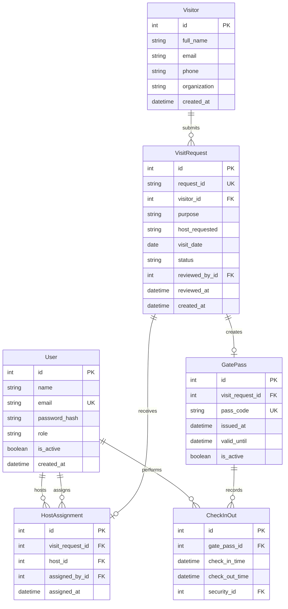

# Database Model

The application uses six core tables. `HostAssignment` has two foreign keys to `User`: one for the assigned host and one for the staff member who made the assignment.

`VisitRequest` may exist without a `GatePass` while it is pending or rejected. A gate pass may exist without any `CheckInOut` rows until security scans it. Each check-in record belongs to a gate pass and stores the optional matching check-out time.
