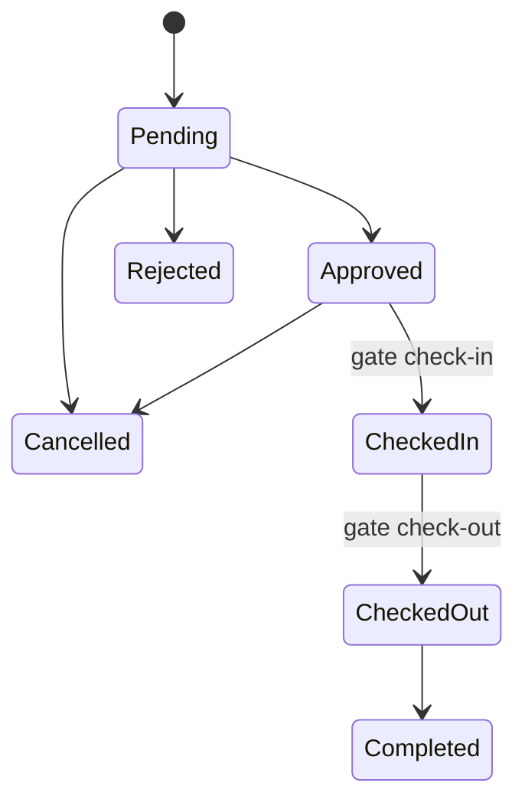

# Campus Visitor System User Guide

This guide covers the complete visitor workflow from request submission to gate check-out.

## Start a demo

From the project root:

```bash
source venv/bin/activate
flask --app run init-db
flask --app run create-admin
flask --app run seed-demo
python run.py
```

Open `http://127.0.0.1:5000` in a browser. Use the admin account created by `create-admin`.

## Visitor

1. Open the home page and choose **Request a visit**.
2. Enter your name, email, phone, visit date, purpose, and optional host details.
3. Save the request and keep the request ID shown on the confirmation page.
4. Open **Check status**, then enter the request ID and the same email address.
5. While the request is pending or approved, choose **Cancel request** if your visit is no longer needed.
6. Once approved, open the gate pass and show its QR code at the gate.

Screenshots to capture:

- `screenshots/visitor-request.png`
- `screenshots/request-confirmation.png`
- `screenshots/status-approved.png`
- `screenshots/printable-pass.png`

## Admin

1. Choose **Staff login** and sign in with the admin account.
2. Review pending requests in **Requests**.
3. Open a request, assign a host if needed, and approve or reject it.
4. Use **Gate Check-in** to look up a pass manually or scan its QR code.
5. Use **Visit History** to search visits and download the filtered CSV export.
6. Use **Users** to create, activate, or deactivate staff accounts.
7. Click the avatar, choose **My profile**, and update your profile or password.

Screenshots to capture:

- `screenshots/admin-dashboard.png`
- `screenshots/requests-queue.png`
- `screenshots/request-detail.png`
- `screenshots/gate-page.png`
- `screenshots/history.png`
- `screenshots/users.png`

## Security staff

1. Sign in with a security account.
2. Open **Gate Check-in**.
3. Scan the visitor QR code or type the pass code.
4. Confirm the visitor details, then choose **Check in**.
5. When the visitor leaves, look up the same pass and choose **Check out**.
6. Use **Inside Campus** to see who is currently checked in.

Screenshot to capture:

- `screenshots/inside-campus.png`

Camera notes:

- Use `http://localhost` or `http://127.0.0.1`, or serve the app over HTTPS.
- Allow camera access when the browser asks.
- In VirtualBox, enable **Devices > Webcam** before testing a physical camera.
- The scanner asset is bundled locally, but the browser still needs permission to use the camera.
- Typing the pass code remains available if a camera is unavailable.

## Hosts

1. Sign in with a host account.
2. Open **Visit History** to see visits assigned to you.
3. Use the search and date filters to find a visitor or request.

Hosts cannot see other hosts' assigned visits or admin-only request management pages.

## Status flow


